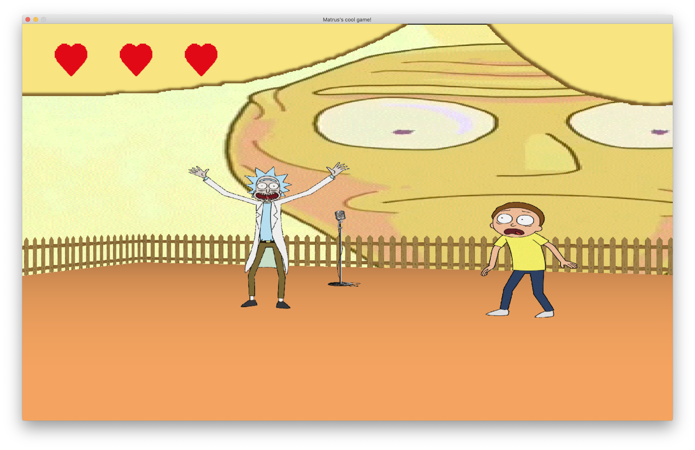
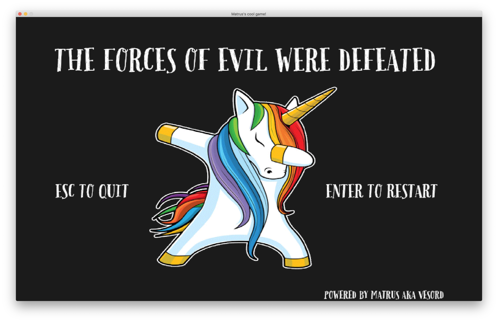

# Raycaster on plain C

## Description
It's a “realistic” 3D graphical representation of the inside of a maze from a first person perspective. This made by using the Ray-casting principles.

It was made due to my studying in 21-school, Russia.
The main goal of project - learn what is ray-casting is and make a program, which represents a walking into maze.

## Requirements

#### Ubuntu, Linux

**ONE COMMAND LINUX**:
`git clone --recursive https://github.com/vesord/cub3d ; cd cub3d ; make bonus ; ./cub3D ./configs/config_bonus_star.cub`

To run this you need to make sure you have these programms installed.
I write `apt` commands to easier install it on Ubuntu.

* `sudo apt-get install gcc`

* `sudo apt-get install make`

* `sudo apt-get install libx11-dev`

Also this project contains submodules [`libft`](https://github.com/vesord/libft "my own utility lib") and [`minilibx`](https://github.com/42Paris/minilibx-linux "lib for easy work with Xlib, made for 42 students")

To clone project with submodules do

* `git clone --recursive https://github.com/vesord/cub3d`

To play run

* `make` or `make bonus`

* `./cub3D ./configs/config.cub`

(In general second argument is a path to config file .cub)

#### MacOS

As for Ubuntu we need submodules [`libft`](https://github.com/vesord/libft "my own utility lib") and [`minilibx`](https://github.com/42Paris/minilibx-linux "lib for easy work with Xlib, made for 42 students").

**ONE COMMAND MACOS**:
`git clone --recursive https://github.com/vesord/cub3d ; cd cub3d ; git checkout macos ; make bonus ; ./cub3D ./configs/config_bonus_star.cub`

Controls are different in MacOS version.
Use `Q` and `E` instead of `left shift` and `left ctrl`.
Some features dosen't work since project was not fully moved from Ubuntu.

## Config file

In general config file contains info about

* Screen resolution. If written resolution is bigger than your screen it will fit to your maximum possible resolution

* Textrures for Notrh, South, East, West walls and sprite in .xpm files

* Ceiling and floor color in R,G,B format

* Map where `1` - wall `0` - empty space `NWES` - initial directoin of a player `2` - sprite

Be sure to check [sample](./configs/config.cub "main part config file") of config file. It's pretty simple to understand how to use it.

## "Bonus"

In case of studying and making more efficient work we do some extra tasks.
You can run 

`make bonus`

then 

`./cub3D configs/config_bonus_star.cub` 

to play little more extanded game. Enjoy it.

Also you can check for [bonus config](./configs/config_bonus_config.cub "sample bonus config file") file and figure out how to modify levels in bonus game.

## --save

In addition you can save a "screenshot" (in .bmp format) of first player view in game by adding `--save` argument to run command.

`./cub3D configs/config.cub --save`

Screenshot wiil appear in project root directory.

# SOME SCREENSHOTS FOR BETTER UNDERSTANDING

